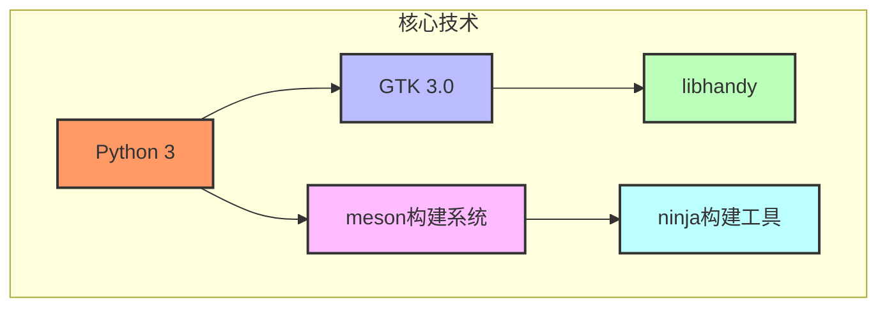
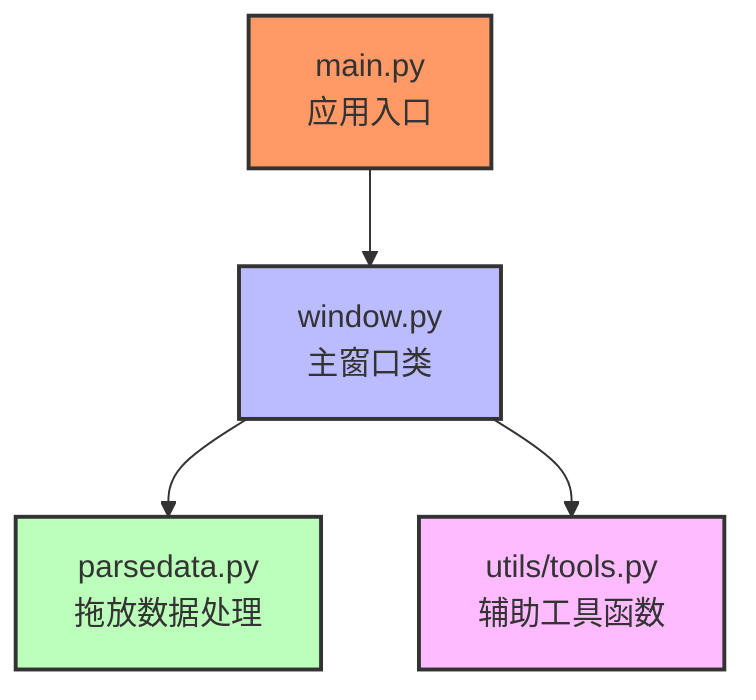
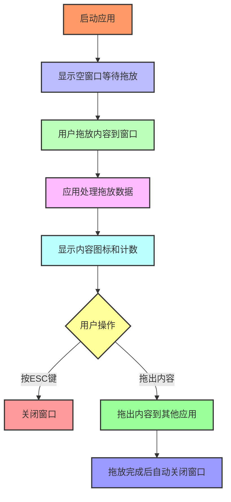
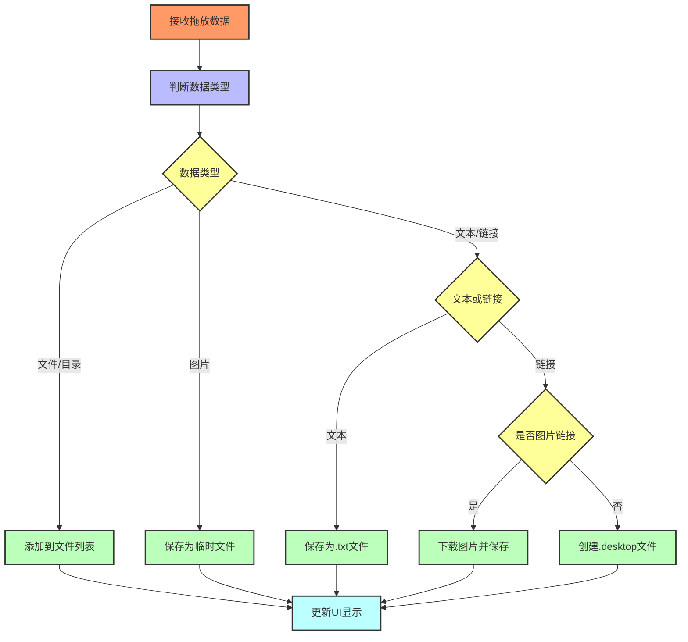

# PyDrop

<p align="center"><strong>一个免费开源的Dropover替代工具</strong></p>

<p align="center">
  <a href="https://github.com/Roshan-R/PyDrop/actions/workflows/main.yml">
    
  </a>
</p>

<p align="center">
  
</p>

## 目录
- [项目简介](#项目简介)
- [功能特点](#功能特点)
- [技术栈](#技术栈)
- [项目结构](#项目结构)
- [工作流程](#工作流程)
- [核心功能实现](#核心功能实现)
- [安装指南](#安装指南)
- [使用方法](#使用方法)
- [开发说明](#开发说明)
- [贡献指南](#贡献指南)
- [许可证](#许可证)

## 项目简介
PyDrop是一款为GNOME桌面环境设计的轻量级拖放工具，提供直观的方式在不同应用程序之间快速移动数据。它是macOS应用Dropover的开源替代方案，专为Linux系统用户打造。

### 主要用途
- 在不同应用程序间临时存储和传递文件、图片和文本
- 快速处理和转换不同类型的数据
- 提供简洁直观的用户界面，减少复制粘贴操作

## 功能特点

| 功能类别 | 功能描述 | 支持格式 |
|---------|---------|--------|
| 文件处理 | 拖放和传递文件/目录 | 所有文件类型 |
| 图片处理 | 接收图片并显示预览 | PNG, JPEG等 |
| 链接处理 | 自动下载图片链接 | 支持图片URL |
| 文本处理 | 保存文本内容为文件 | 纯文本 |
| URL管理 | 将链接保存为桌面条目 | .desktop格式 |
| 视觉反馈 | 显示内容图标和文件计数 | - |
| 拖出功能 | 支持从应用窗口拖出内容 | - |

## 技术栈

### 核心技术



### 依赖库
- **PIL/Pillow**: 图像处理
- **python-magic**: 文件类型检测
- **requests**: 网络资源下载
- **validators**: URL验证
- **PyGObject**: GTK的Python绑定

### 构建工具
- **meson**: 构建系统
- **ninja**: 构建工具

## 项目结构

```
PyDrop/
├── src/                 # 源代码目录
│   ├── main.py          # 应用程序入口
│   ├── window.py        # 主窗口类定义
│   ├── parsedata.py     # 拖放数据处理逻辑
│   ├── pydrop.in        # 启动脚本模板
│   └── utils/           # 工具函数
│       └── tools.py     # 实用工具函数
├── data/                # 资源文件
│   ├── ui/              # UI定义文件
│   │   └── window.ui    # 窗口UI布局
│   ├── css/             # 样式表
│   │   └── style.css    # 应用样式
│   ├── logo/            # 应用图标
│   ├── *.desktop.in     # 桌面文件模板
│   ├── *.appdata.xml.in # 应用元数据
│   └── pydrop.gresource.xml # 资源配置
├── meson.build          # 主构建配置
├── build-aux/           # 构建辅助脚本
└── po/                  # 国际化文件
```

### 模块关系图



## 工作流程

### 主流程



### 数据处理流程



## 核心功能实现

### 1. 拖放系统实现

PyDrop使用GTK的拖放机制实现文件和数据的接收与发送：

- **拖入功能**：通过`drag_dest_set`方法配置接收拖放数据的目标区域
- **拖出功能**：通过`drag_source_set`方法配置可拖动的源区域
- **数据处理**：根据不同的数据类型（文件、图片、文本、链接）使用不同的处理逻辑

### 2. 数据处理模块

`parsedata.py`模块负责处理不同类型的拖放数据：

- **文件URI处理**：直接保留文件路径
- **图片数据处理**：保存到临时目录
- **文本处理**：保存为.txt文件
- **链接处理**：
  - 检测是否为图片链接
  - 对于图片链接：下载并保存为本地文件
  - 对于普通链接：创建.desktop文件

### 3. 用户界面

UI设计简洁明了，主要包含以下元素：

- 拖放区域：接收用户拖放的内容
- 显示图标：展示最近添加内容的预览
- 文件计数按钮：显示当前保存的文件数量
- 菜单按钮：包含关于信息等

## 安装指南

### 方法一：使用GNOME Builder

1. 下载并安装GNOME Builder
2. 点击底部的"Clone Repository"按钮
3. 输入仓库URL：`https://github.com/Roshan-R/PyDrop`
4. 项目加载完成后，点击顶部的构建按钮

### 方法二：从源代码构建

```bash
git clone https://github.com/Roshan-R/PyDrop.git
cd PyDrop
meson builddir --prefix=/usr/local
sudo ninja -C builddir install
```

### 依赖要求

在构建前，请确保已安装以下依赖：

```
python3
gtk3
glib
python3-pillow
python3-magic
python3-requests
python3-validators
libhandy-1-dev
meson
ninja-build
```

## 使用方法

### 基本操作

1. **启动应用**：通过应用菜单或终端运行`pydrop`命令
2. **添加内容**：将文件、图片、文本或链接拖放到PyDrop窗口
3. **查看内容**：窗口会显示最近添加内容的图标和总文件数
4. **使用内容**：从窗口拖动内容到其他应用程序
5. **退出应用**：完成拖放后自动关闭，或按ESC键手动关闭

### 支持的拖放操作

- **文件和文件夹**：直接拖入拖出
- **图片**：支持从浏览器或其他应用拖入，自动保存为图片文件
- **文本**：自动保存为.txt文件，方便在文本编辑器间传递
- **链接**：
  - 图片链接：自动下载图片并保存
  - 普通链接：创建可点击的.desktop文件

## 开发说明

### 开发环境设置

1. 克隆仓库：`git clone https://github.com/Roshan-R/PyDrop.git`
2. 进入项目目录：`cd PyDrop`
3. 安装依赖
4. 使用meson配置：`meson builddir`
5. 构建项目：`ninja -C builddir`
6. 运行应用：`./builddir/src/pydrop`

### 代码贡献

如果你想为PyDrop项目做出贡献，请遵循以下步骤：

1. Fork项目仓库
2. 创建你的功能分支：`git checkout -b feature/amazing-feature`
3. 提交你的更改：`git commit -m 'Add some amazing feature'`
4. 推送到分支：`git push origin feature/amazing-feature`
5. 打开一个Pull Request

## 许可证

本项目采用GNU通用公共许可证v3.0（GPL-3.0）。详见[COPYING](COPYING)文件。

## 致谢

感谢所有为PyDrop项目做出贡献的开发者和用户！